---

## About Me

B.Tech CSE student with a focus on **Cybersecurity and Digital Forensics**. I enjoy building security-oriented tools that address real DFIR and host security problems — from file integrity monitoring and metadata forensics to cryptographic file protection.

My interests span DFIR workflows, incident response concepts, file integrity and metadata analysis, secure software development, Linux, and networking fundamentals. I build practical, portfolio-ready projects that reflect my learning and development direction.

---

## Technical Skills

**Languages**

**Security & Systems**

`Linux` &nbsp; `Digital Forensics` &nbsp; `Incident Response` &nbsp; `File Integrity Monitoring` &nbsp; `Cryptography` &nbsp; `Networking`

**Tools & Technologies**

`OpenSSL` &nbsp; `CMake`

---

## Current Focus

- Building security and DFIR utilities in Java and Python
- Improving software architecture and design patterns
- Strengthening Linux and networking fundamentals
- Exploring incident response and forensic analysis workflows
- Deepening understanding of cryptographic standards and secure file handling
- Developing portfolio-ready security projects for internship applications

---

## Featured Projects

### [Nexis — File Integrity & Host Intrusion Detection Monitor](https://github.com/Tanmay-Bhatnagar22/Nexis)

> *Current active project — Java-based security and DFIR tool*

Nexis is a **Java-based File Integrity & Host Intrusion Detection Monitor** designed to detect unauthorized file modifications using cryptographic hashing, monitor system activity, and generate security alerts and logs for effective host-level threat detection.

- Cryptographic hashing for file integrity verification
- Detection of unauthorized file modifications and suspicious changes
- Security alert and log generation for host-level threat detection
- CLI-driven core engine architecture
- Maven-based Java project structure

`Java` &nbsp; `Maven` &nbsp; `Cryptographic Hashing` &nbsp; `File Integrity Monitoring` &nbsp; `HIDS`

---

### [TraceLens — Intelligent Metadata Analysis & Privacy Inspection Toolkit](https://github.com/Tanmay-Bhatnagar22/TraceLens)

> *Forensics-focused metadata analysis desktop tool*

TraceLens is a **comprehensive desktop application** for extracting, analyzing, editing, and managing file metadata with a focus on privacy and forensic risk assessment. It provides both a GUI dashboard and a command-line interface for forensic analysts and privacy-conscious users.

- Multi-format metadata extraction and structured analysis
- Privacy and forensic risk assessment from file metadata
- Dual interface: GUI dashboard (Tkinter) and CLI
- Designed for digital forensics workflows and evidence-focused inspection
- Supports metadata viewing, editing, and export

`Python` &nbsp; `Tkinter` &nbsp; `Digital Forensics` &nbsp; `Metadata Analysis` &nbsp; `Privacy Inspection`

---

### [Aesora — Secure File Encryption Tool](https://github.com/Tanmay-Bhatnagar22/Aesora)

> *C++ command-line cryptographic security tool*

Aesora is a **high-performance, command-line file encryption tool** built in C++ that ensures secure data protection using modern cryptographic standards. It allows users to encrypt and decrypt files efficiently while maintaining data integrity and confidentiality.

- AES-256-GCM authenticated encryption
- PBKDF2-HMAC-SHA256 key derivation
- Secure random generation and cryptographic workflows
- OpenSSL-backed implementation
- Command-line interface for scriptable, efficient use

`C++` &nbsp; `OpenSSL` &nbsp; `AES-256-GCM` &nbsp; `PBKDF2` &nbsp; `CMake` &nbsp; `Cryptography`

---

## GitHub Statistics

  
  

  

---

## Security Interests

`Digital Forensics` &nbsp; `Incident Response` &nbsp; `File Integrity Monitoring` &nbsp; `Host Security` &nbsp; `Cryptography` &nbsp; `Metadata & Privacy Analysis` &nbsp; `Linux & Networking` &nbsp; `Secure Software Development`

---

## Connect With Me

  
  &nbsp;
  
  &nbsp;
  

